<p align="center">
  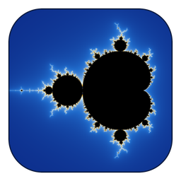
</p>

<h1 align="center">Mandelbrotter</h1>

<p align="center">
  <b>An interactive explorer for the Mandelbrot set and its relatives, zooming as deep as 10<sup>300</sup>.</b><br>
  Multi-threaded and progressive, and sharp at any depth. Linux, macOS and Windows.
</p>

<p align="center">
  <a href="https://github.com/cthunter01/Mandelbrotter/releases/latest"></a>
  <a href="https://github.com/cthunter01/Mandelbrotter/actions/workflows/ci.yml"></a>
  
  
</p>

<p align="center">
  
</p>

<p align="center">
  <a href="#download">Download</a> ·
  <a href="#a-quick-tour">Tour</a> ·
  <a href="#demo-flights">Demo flights</a> ·
  <a href="#command-line">Command line</a> ·
  <a href="#building-from-source">Building</a> ·
  <a href="#for-developers">Developers</a>
</p>

## Features

- **Four fractal families**: Mandelbrot and Multibrot (`z^n + c`, n = 2 to 8), Burning Ship and Tricorn, plus the
  Julia set of any of them, with a live preview that follows the mouse.
- **Deep zoom to 10<sup>300</sup>**, far past the 10<sup>13</sup> where ordinary double-precision explorers turn
  blocky. The view centre is a big number whose precision follows the zoom; deep pixels are iterated as tiny
  offsets from one precise reference orbit (perturbation), and bilinear approximation skips the long stretches
  where nothing interesting happens.
- **Fast and responsive**: every core renders; a coarse picture appears at once and sharpens in passes; any
  movement cancels the render in flight. The iteration limit grows with the zoom on its own (up to 1,000,000).
- **Colour**: smooth escape-time colouring, six palettes, density and offset controls, and recolouring that never
  recomputes.
- **Keep what you find**: bookmarks, view files that reload bit for bit, PNG export at any resolution with
  anti-aliasing, copy to clipboard, and a headless `--render` mode for scripts.
- **Learn as you go**: a built-in illustrated guide whose "Try it" links act on the window, a guided tour, and six
  animated demo flights.

## Download

Ready-to-run builds are on the [latest release](https://github.com/cthunter01/Mandelbrotter/releases/latest):

| Platform | Archive | Runs on |
| --- | --- | --- |
| Windows | `Mandelbrotter-<version>-windows-x86_64.zip` | 64-bit Windows 10 or 11 |
| macOS | `Mandelbrotter-<version>-macos-universal.tar.gz` | macOS 26 or later, Apple silicon and Intel |
| Linux | `Mandelbrotter-<version>-linux-x86_64.tar.gz` | x86-64 with glibc 2.39+ (Ubuntu 24.04+, Debian 13+, Fedora 40+, RHEL 10+) and GTK 3 |

- **Windows**: unzip anywhere and run `bin\Mandelbrotter.exe`. The program is not code-signed, so SmartScreen may
  warn the first time (More info > Run anyway).
- **macOS**: unpack and drag `Mandelbrotter.app` into Applications. It is not notarized, so clear the download
  quarantine once: `xattr -dr com.apple.quarantine /Applications/Mandelbrotter.app`.
- **Linux**: unpack into `~/.local`, which puts `Mandelbrotter` in `~/.local/bin` and adds it, with its icon, to
  the applications menu:

  ```sh
  tar -xzf Mandelbrotter-*-linux-x86_64.tar.gz --strip-components=1 -C ~/.local
  ```

Each release also carries a `SHA256SUMS` file. To build it yourself, see [Building from source](#building-from-source).

## A quick tour

### 1. Look around

<p align="center">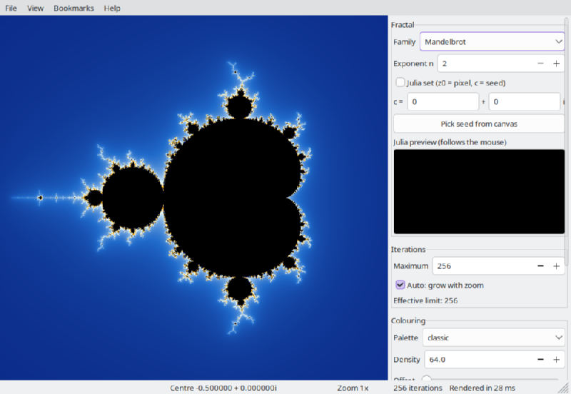</p>

The picture fills most of the window. The panel on the right holds the fractal, iteration, colouring, overlay and
bookmark settings, and the status bar shows the centre, the zoom, the iteration limit and how long the picture
took.

| To | Mouse | Keyboard |
| --- | --- | --- |
| Zoom in or out at a point | wheel | `+` / `-`, or Page Up / Page Down (at the centre) |
| Move around | drag | arrow keys |
| Zoom into a rectangle | right-drag, or Shift-drag | |
| Zoom out | right-click | |
| Start over | | `Home` (View > Reset view, Ctrl+Home) |

Help > Keyboard and mouse reference lists them all.

### 2. Pick a fractal

The Family list in the panel switches between the families; the exponent turns `z^2 + c` into `z^n + c`.

| | |
| :---: | :---: |
| 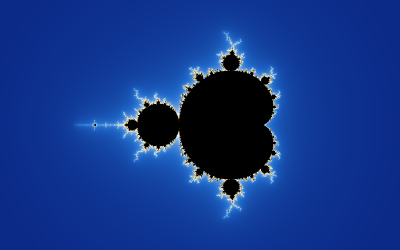<br>Mandelbrot, `z^2 + c` | 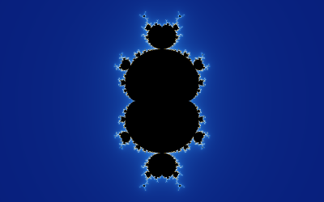<br>Multibrot, `z^3 + c` |
| 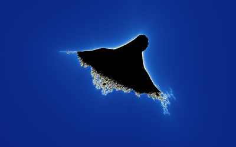<br>Burning Ship | 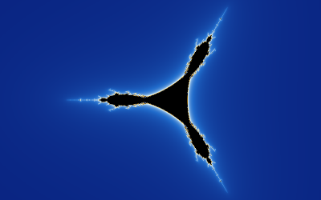<br>Tricorn |

### 3. Meet the Julia sets

Every point `c` of the Mandelbrot set has a Julia set of its own. While the mouse moves over the picture, the
preview in the panel shows the Julia set of the point under it. Click **Pick seed from canvas**, then click a
point, and the window switches to that Julia set; the constant can also be typed in.

| | |
| :---: | :---: |
| <br>c = −0.8 + 0.156i | 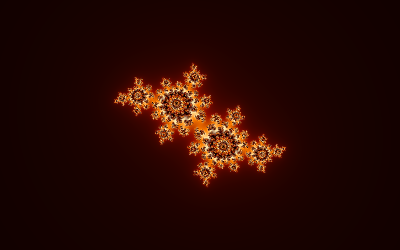<br>c = −0.4 + 0.6i |
| 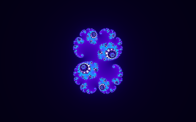<br>c = 0.285 + 0.01i | 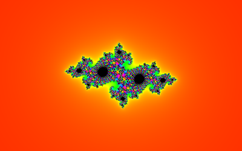<br>c = −0.7269 + 0.1889i |

### 4. Colour it

Six palettes, plus density (how fast the colours cycle) and offset (where the cycle starts). Changing any of them
recolours the picture instantly, without computing it again.

| | | |
| :---: | :---: | :---: |
| 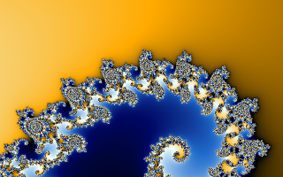<br>classic | 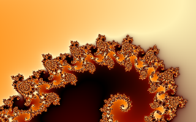<br>fire | <br>ocean |
| 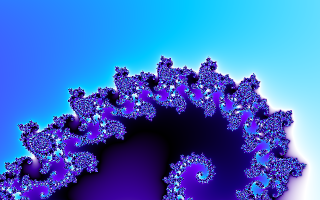<br>electric | 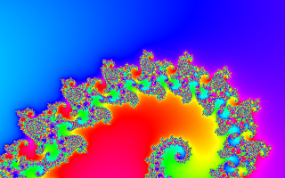<br>rainbow | 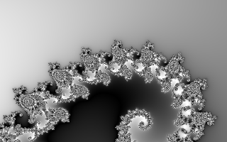<br>grayscale |

### 5. Go deep

<p align="center">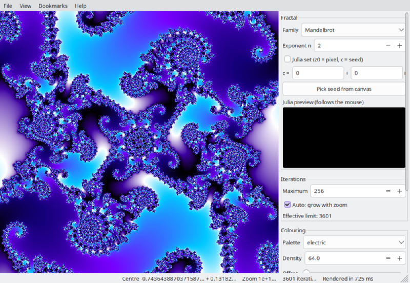</p>

Keep zooming. Around 10<sup>13</sup> ordinary doubles can no longer tell neighbouring pixels apart, and the picture
of a typical explorer dissolves into blocks. Mandelbrotter switches to perturbation above zoom 10<sup>8</sup> and
stays sharp all the way to 10<sup>300</sup>. Deeper views need more iterations before points escape; with
**Auto: grow with zoom** ticked (the default) the limit follows the zoom:

| | |
| :---: | :---: |
| 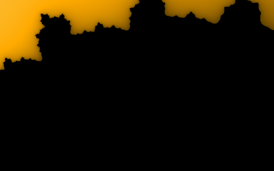<br>50 iterations: too few, the detail is lost | 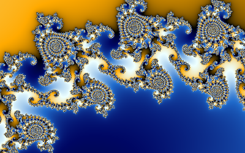<br>2,000 iterations |

### 6. Watch a point's orbit

<p align="center">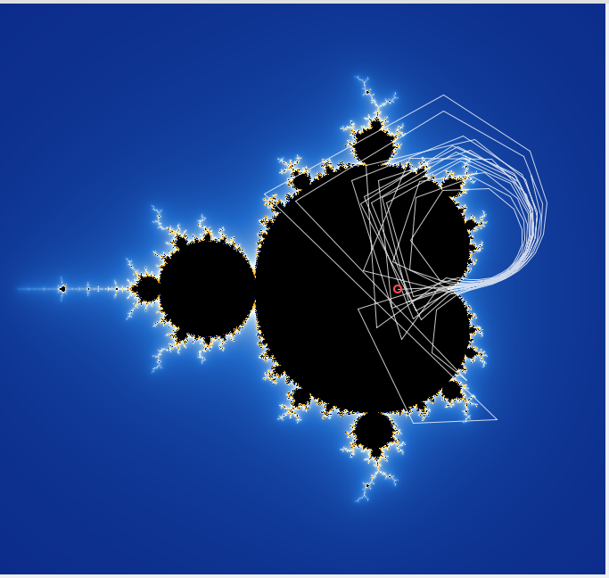</p>

Tick **Show orbit of the point under the cursor** and the picture shows the path `z` takes from the point under
the mouse: points inside the set settle into a loop, points outside fly off.

### 7. Keep what you find

- **Bookmarks** (Bookmarks > Add bookmark, Ctrl+D) remember a view with its fractal and colours.
- **File > Save image as PNG** (Ctrl+S) exports at any size up to 16384 × 16384, with up to 4 × 4 anti-aliasing.
- **File > Copy image** (Ctrl+C) puts the picture on the clipboard.
- **File > Export view** writes a small JSON file, with the centre spelled out in as many digits as the zoom needs,
  so a view reloads bit for bit; `Mandelbrotter --view my-view.json` opens it.

Bookmarks live in `~/.local/share/Mandelbrotter/bookmarks.json` on Linux,
`~/Library/Application Support/Mandelbrotter/bookmarks.json` on macOS and `%APPDATA%\Mandelbrotter\bookmarks.json`
on Windows.

### 8. Ask the program itself

| | |
| :---: | :---: |
| 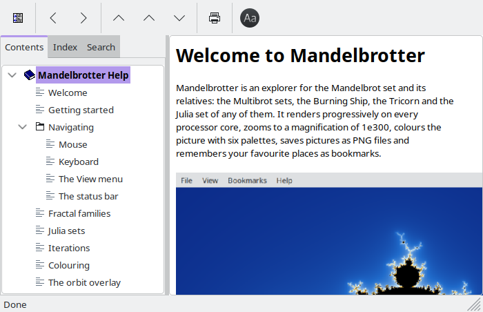<br>Help > Contents: an illustrated guide with a contents tree, an index and search; its "Try it" links act on the window | 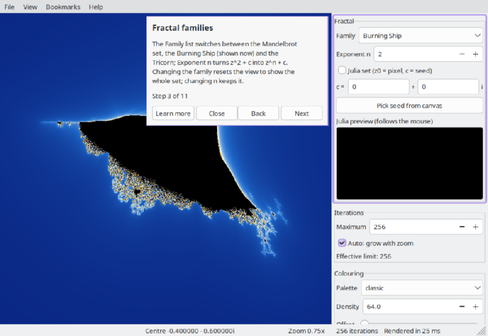<br>Help > Take a tour walks through the window step by step |

F1 opens the guide's page for whichever control has the focus.

## Demo flights

Help > Demos flies the window through six scripted journeys. Here they are frame by frame, each frame rendered to
completion (the window itself shows a coarse first pass while it moves):

| | |
| :---: | :---: |
| 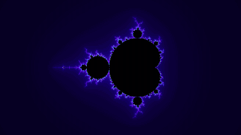<br>**Dive into Seahorse Valley**<br>From the whole set down to a minibrot at zoom 10<sup>13</sup> | <br>**The minibrot on the antenna**<br>Along the real axis to the little copy of the set at −1.75, then to the copy on its own antenna |
| 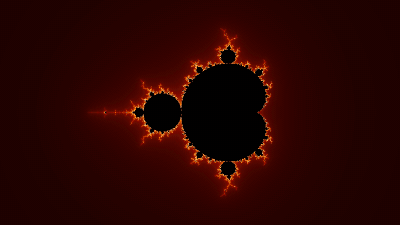<br>**Elephant Valley spirals**<br>Into the spirals on the right-hand side of the set, to zoom 10<sup>7</sup> | 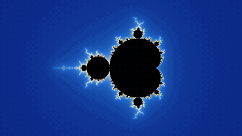<br>**The Feigenbaum cascade**<br>Down the real axis to where the period doubling repeats at every scale |
| <br>**A walk around the Julia sets**<br>The Julia set morphs as its constant circles \|c\| = 0.7885 | 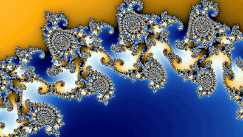<br>**Palette sweep**<br>The same view while the palette cycles once through its colours |

## Command line

```
usage: Mandelbrotter [options]

  -h, --help              show this help and exit
  -o, --render FILE.png   render headlessly to a PNG file and exit
      --view FILE.json    start from a saved view (File > Export view..., or a bookmark)
      --fractal NAME      mandelbrot (default), burning-ship or tricorn
      --exponent N        z^N + c, N from 2 to 8 (default 2)
      --julia RE,IM       draw the Julia set for the constant c = RE + IM i
      --center RE,IM      centre of the view
      --zoom Z            magnification (1 shows the whole set; up to 1e+300)
      --iterations N      fixed iteration limit (default: automatic, grows with zoom)
      --palette NAME      one of: classic, grayscale, fire, ocean, rainbow, electric
      --size WxH          output size for --render (default 1920x1080)
      --supersample K     anti-aliasing for --render: 1, 2 or 4 samples per axis (default 1)
```

Without `--render` the options set the window's starting view. `--render` needs no display at all, so it works
over SSH and in scripts:

```sh
# Seahorse Valley, anti-aliased
Mandelbrotter --render seahorse.png --center -0.7436,0.1318 --zoom 5000 --iterations 2000 \
              --palette electric --supersample 2

# The Burning Ship's little ship
Mandelbrotter --render ship.png --fractal burning-ship --center -1.75,-0.03 --zoom 40 --palette fire

# The banner at the top of this page: a centre of any length keeps every digit
Mandelbrotter --render banner.png --size 1600x480 --supersample 4 --zoom 4e5 \
              --center -0.743643887037158704752191506114774,0.131825904205311970493132056385139
```

On macOS the executable is inside the app: `Mandelbrotter.app/Contents/MacOS/Mandelbrotter --render ...`.

## Building from source

On every platform: CMake 3.28+, Ninja and Git. wxWidgets is downloaded and built from source as static
libraries by the first configure (a few minutes); GoogleTest and nlohmann/json are used from the system if
installed, otherwise downloaded.

- **Linux**: GCC 14+, or Clang 22+ with GCC 14+'s libstdc++ (C++23 including `<print>` and `<expected>`; Clang
  18 cannot build it, 19 to 21 are untested), plus the GTK 3 development files and `pkg-config` (GTK itself
  stays a system library). On Arch: `pacman -S cmake ninja gtk3 pkgconf`;
  on Debian/Ubuntu: `apt install cmake ninja-build libgtk-3-dev pkg-config`.
- **macOS**: Xcode 26.6 or later (its Apple Clang is what CI uses; earlier Xcode 26 releases are untested), and
  Ninja and CMake from Homebrew: `brew install cmake ninja`. wxWidgets uses Cocoa, so nothing else is needed.
- **Windows**: Visual Studio 2026 (what CI uses; Visual Studio 2022 17.8 or later should also work) with the
  *Desktop development with C++* workload, which includes MSVC, CMake and Ninja. Run every `cmake` command
  from a *Developer PowerShell for VS* (x64) so the compiler is on the PATH. Symlinks need Developer Mode
  turned on; without it the build still works, only the `compile_commands.json` link for clangd is skipped.
- Optional, all platforms: clang-format, ccache (strongly recommended: every preset builds wxWidgets once, and
  ccache shares the result between presets with the same flags), Doxygen. Linux and macOS only: clang-tidy and
  llvm-cov/llvm-profdata for the `tidy` and `coverage` presets (on macOS from `brew install llvm`; the presets
  find them there without touching your PATH).

Linux:

```sh
cmake --workflow --preset dev          # configure + build + test (Clang, Debug)
./build/clang-debug/bin/Mandelbrotter  # open the window
```

macOS builds an app bundle: `open build/clang-debug/bin/Mandelbrotter.app`.

Windows, in a Developer PowerShell for VS:

```powershell
cmake --workflow --preset dev-msvc         # configure + build + test (MSVC, Debug)
.\build\msvc-debug\bin\Mandelbrotter.exe   # open the window
```

Debug builds render slowly; for exploring, build the release preset:

```sh
cmake --preset clang-release               # configure once; Windows: msvc-release
cmake --build --preset clang-release       # build (`clang-release` is a build preset, not a workflow)
./build/clang-release/bin/Mandelbrotter
```

## For developers

### Presets

Every preset builds into `build/<preset>/`. A preset only exists on the platforms whose compiler it uses, so
`cmake --list-presets` shows the ones available on this machine.

| Preset | Platforms | What it does |
|---|---|---|
| `dev` (workflow) | Linux, macOS | Clang, Debug: configure, build, test |
| `dev-msvc` (workflow) | Windows | MSVC, Debug: configure, build, test |
| `clang-debug`, `clang-release` | Linux, macOS | configure/build/test presets per build type |
| `gcc-debug`, `gcc-release` | Linux | the same with GCC |
| `msvc-debug`, `msvc-release` | Windows | the same with MSVC |
| `asan` | Linux, macOS | Clang Debug with AddressSanitizer + UndefinedBehaviorSanitizer |
| `tsan` | Linux, macOS | Clang RelWithDebInfo with ThreadSanitizer |
| `tidy` | Linux, macOS | Clang Debug with clang-tidy, warnings as errors |
| `coverage` | Linux, macOS | Clang Debug with source-based coverage; report in `build/coverage/coverage/` |
| `ci-gcc`, `ci-clang`, `ci-msvc` | Linux / Linux, macOS / Windows | Release, warnings as errors (what CI runs) |
| `dist-linux`, `dist-macos`, `dist-windows` | Linux, macOS, Windows | The release archives (see [Releases](#releases)) |

Configure, build and test can also be run separately: `cmake --preset clang-debug`,
`cmake --build --preset clang-debug`, `ctest --preset clang-debug`. The `dist-*` workflow presets also package.

CI (GitHub Actions) runs `ci-gcc`, `ci-clang`, `asan` and `tidy` on Arch Linux, `ci-clang` on macOS, `ci-msvc` on
Windows, and a clang-format check.

### Releases

The `Release` GitHub workflow (`.github/workflows/release.yml`) runs only when started by hand, never on a push:

1. Raise `VERSION` in `project()` in `CMakeLists.txt`, then commit and push.
2. Start it from the Actions tab (Release > Run workflow, pick the branch) or with `gh workflow run release.yml`
   (`-f prerelease=true` marks it a pre-release).

It stops at once if the tag `v<version>` already exists. Otherwise it runs all of CI and builds, tests and
packages an archive on each platform, and checks the packaged macOS app (its signature, and a render from inside
it). Only when every job passes does it tag the commit `v<version>` and publish a GitHub release with the
archives, a `SHA256SUMS` file and generated release notes.

| Archive | Built with | Holds |
| --- | --- | --- |
| `Mandelbrotter-<version>-linux-x86_64.tar.gz` | Clang 22, Ubuntu 24.04 | `bin/Mandelbrotter`, a `.desktop` file and the icon, laid out like `/usr` or `~/.local` |
| `Mandelbrotter-<version>-macos-universal.tar.gz` | Apple Clang | `Mandelbrotter.app`, a universal bundle signed ad hoc |
| `Mandelbrotter-<version>-windows-x86_64.zip` | MSVC | `bin/Mandelbrotter.exe`, with its icon and a per-monitor DPI manifest |

The C++ runtime is linked into the Linux and Windows executables, so users need no libstdc++ or VC++
Redistributable. GTK 3 stays a system shared library on Linux (as in a normal build); it is the default on
virtually every Linux desktop. Dependencies (wxWidgets, GoogleTest, nlohmann/json) are always built from source for
a release, never taken from the build machine. An archive holds what the `install()` rules install: add rules for
anything else it should ship.

Build one locally with `cmake --workflow --preset dist-linux` (or `dist-macos`, `dist-windows`); it lands in
`build/dist-<os>/package/`.

### Layout

- `include/Mandelbrotter/`, `src/core/`: the core library (`Mandelbrotter_lib`). Fractal kernels, viewport
  maths, palettes, the progressive multi-threaded renderer, PNG export, bookmarks, the demo flights and the
  command-line parser. No GUI dependency, fully unit-tested.
- `src/gui/`: the wxWidgets layer (`Mandelbrotter_gui`): main frame, canvas, side panel, dialogs, the help
  window, the demo player, the guided tour and the screenshot mode.
- `src/main.cpp`: the executable; dispatches between the CLI and the GUI. Beside it, what each platform needs
  around the executable: `Mandelbrotter.rc` (Windows resources), `Mandelbrotter.plist.in` (the macOS bundle's
  Info.plist) and `Mandelbrotter.desktop` (the Linux menu entry).
- `src/icons/`: the application icon, rendered by Mandelbrotter itself.
- `src/tools/`: build-time tools (`Mandelbrotter_embed` turns the help book and the icon into C++ sources).
- `docs/help/`: the help book: hand-written pages in wxHTML, the contents tree and index, and the images. It is
  zipped and embedded into the executable at build time.
- `docs/readme/`: this page's banner and animations.
- `tests/`: GoogleTest suites for the core, plus a headless integration test that runs the real executable.
- `cmake/`: dependency and build configuration.

Doxygen documentation: `cmake --build --preset clang-debug --target docs` (needs Doxygen).

### Generated pictures

All pictures in the repository are rendered by Mandelbrotter itself and committed. Regenerate them with a release
build on Linux:

- **The help book's images**, after a change to the window or to the rendered examples:

  ```sh
  cmake --build --preset clang-release
  ./build/clang-release/bin/Mandelbrotter --screenshots docs/help/images   # on Wayland: GDK_BACKEND=x11 ...
  ```

  The run renders the example pictures, opens the window, walks it through the documented states, saves each as a
  PNG and quits. Run it twice when the pictures themselves changed, so the screenshot of the help window shows the
  new ones. It never touches your own bookmarks. The pages under `docs/help/` are plain HTML (the subset wxHTML
  renders; see `docs/help/README.md`) and are checked by the tests: every link, image and "Try it" action must
  resolve.
- **This page's banner and demo animations**: `docs/readme/make_media.sh` (needs ImageMagick 7 and ffmpeg). The
  animations come from `Mandelbrotter --flight ID --flight-frames DIR [--fps N]`, a developer option that renders
  every frame of a demo flight to completion.
- **The application icon**: `src/icons/make_icons.sh` (needs ImageMagick 7 and Python 3 with Pillow).
